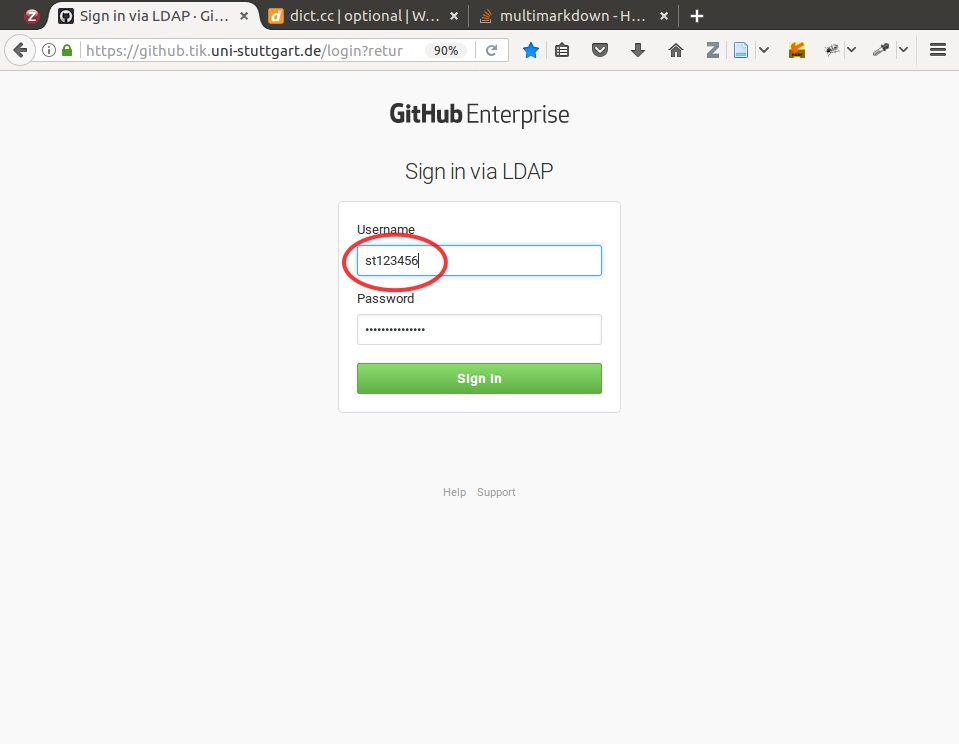
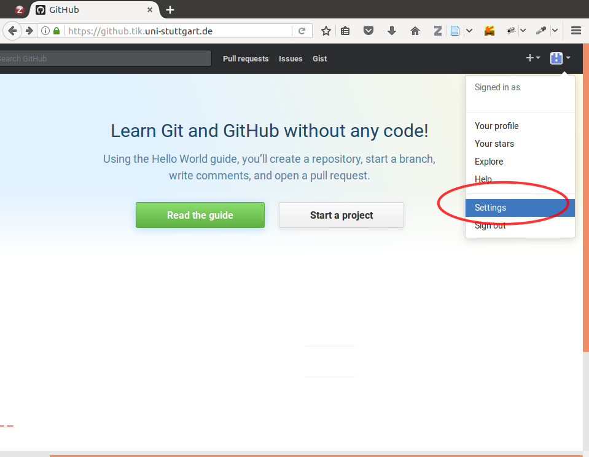
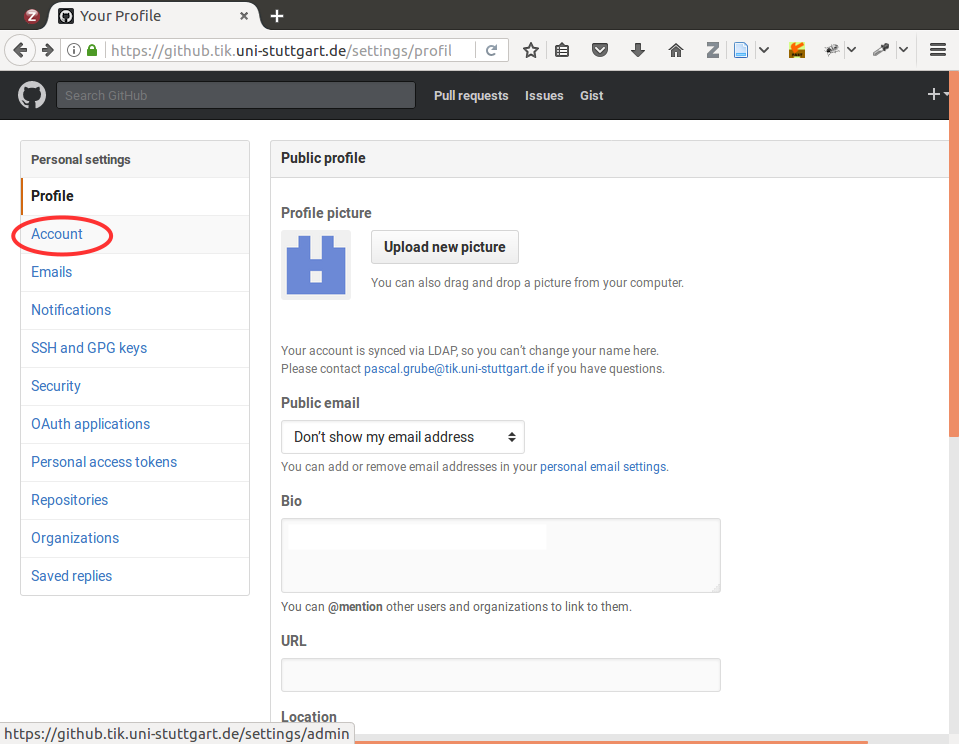
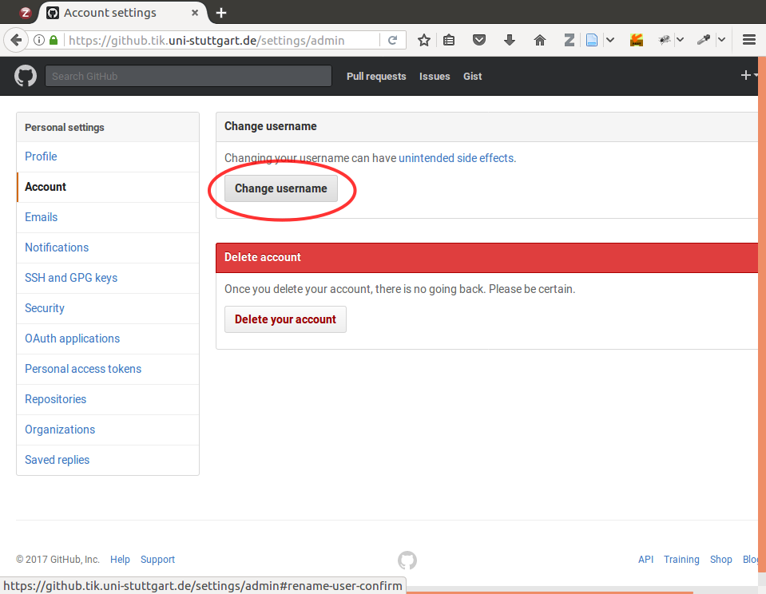
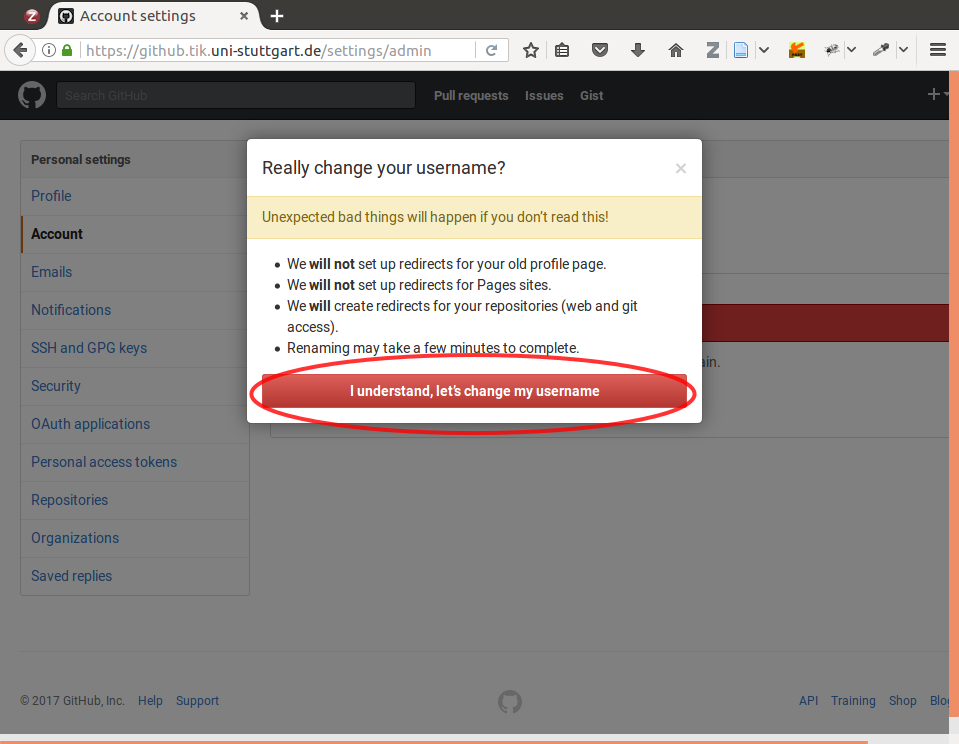
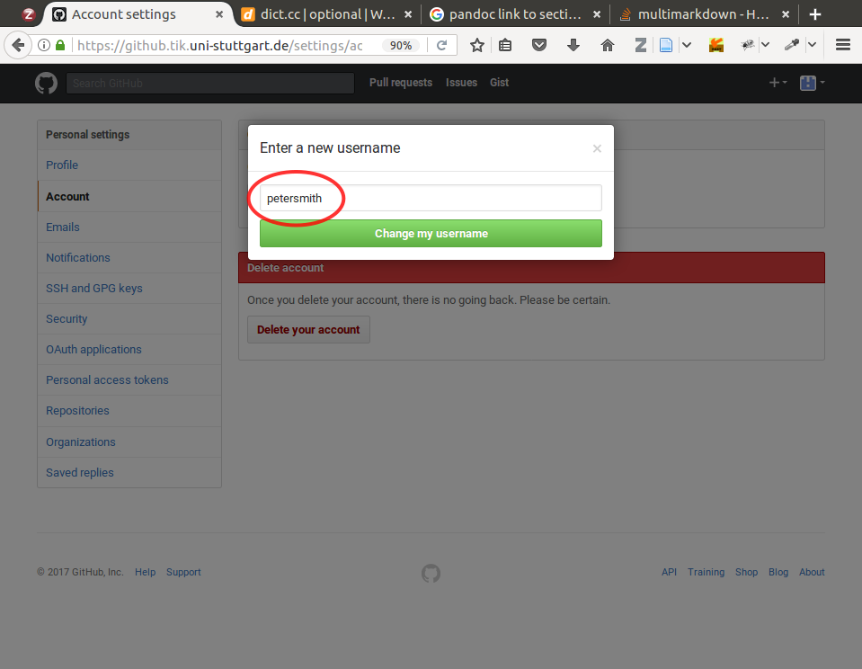
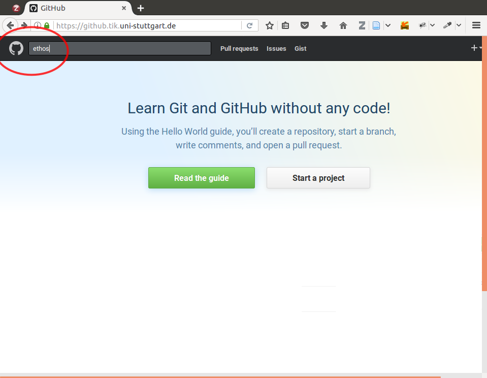
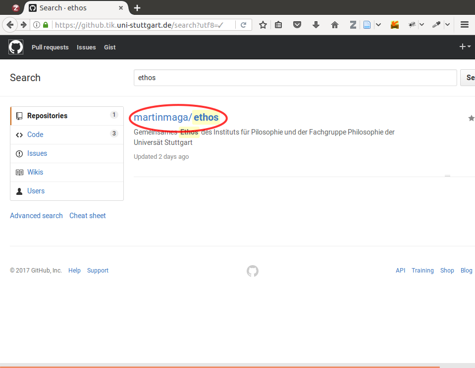
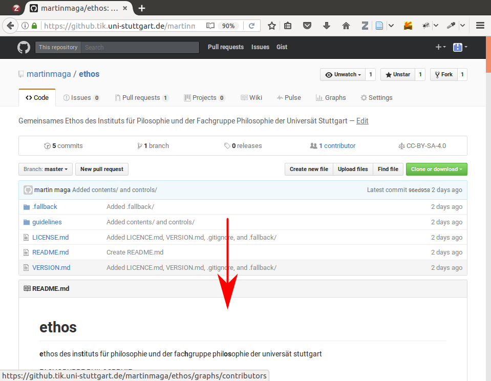

% How to join the ethos project on *www.github.tik.uni-stuttgart.de*
% Fachgruppe Philosophie
% Stuttgart, 30. Januar 2016

# There is …
… a screen shot for every step in section [Screen shots](#screen-shots).

# Login
  1. In your browser go to: *https://github.tik.uni-stuttgart.de*
  2. Bookmark the site.
  3. Enter your username: *st123456*
  Your full username at the University of Stuttgart is an e-mail address
  with the following pattern: *st123456@stud.uni-stuttgart.de*
  On *www.github.tik* you have to enter only the first part of your username
  i.e., everything before the *@* sign.
  4. Enter your corresponding password.
  
# Change your username
  1. At the top right corner go to (click on the pixel symbol):
  *View profile and more > Settings*
  2. At the left menu go to: *Personal settings > Account*
  3. At the top under “Change username” go to (click on):
  *Change username*
  Just ignore the statement “Changing your username can have unintended side effects”.
  Everything is going to be fine.
  4. After you clicked the “Change username” button a pop-up menu will appear titled
  “Really change username? Unexpected bad things will happen if you don’t read this!” 
  *Ignore it.* (Of course you can read it--but ignore it in the end.)
  5. In this pop-up menu go to (click on):
  *I undestand, let’s change my username*
  6. In the new pop-up menu titled “Enter a new username” enter a sensible
  username like your your full name i.e., your first name and your last name
  combined without white-space character or any other character
  Here is an example username: peterpan
  7. Click on: „Change my username“.
  8. Optionally: Edit your profile, add your city, add a photo, …
  
# Go to the ethos repository
  1. In the top left corner there is a silhouette of a cat (the GitHub symbol)
  and right next to it there is a search field “Search GitHub”.
  2. In this search field enter: *ethos*
  3. On the search result page click on: */martinmaga/ethos*
  4. Bookmark this site: *https://github.tik.uni-stuttgart.de/martinmaga/ethos*
  5. Brows through the repository.
  6. Don’t Panic! Play around! You are *not* going to break anything.
  
# Tell us your username at github.tik
  1. Let us know your username so that we can add you as contributor to our
  ethos project repository.

# Screen shots

